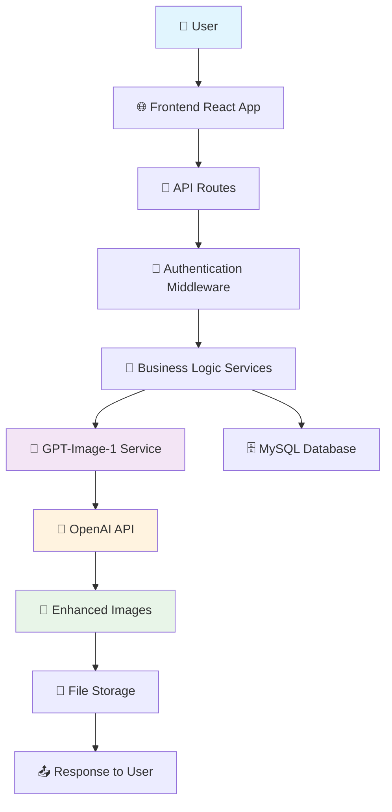

# DrisyaEnhance - GPT-Image-1 Code Flow Architecture

## 🏗️ Project Structure Overview

```
DrisyaEnhance/
├── 📱 client/                    # Frontend (React + TypeScript)
│   ├── src/
│   │   ├── App.tsx              # Main App Component
│   │   ├── components/          # UI Components
│   │   ├── pages/               # Page Components
│   │   ├── hooks/               # Custom React Hooks
│   │   └── lib/                 # Utilities & Config
├── 🖥️ server/                    # Backend (Express + TypeScript)
│   ├── index.ts                 # Server Entry Point
│   ├── routes.ts                # API Routes
│   ├── db.ts                    # Database Connection
│   ├── services/                # Business Logic
│   └── types/                   # Type Definitions
├── 🎨 GPT-Image-1 Scripts/       # AI Enhancement Scripts
│   ├── gpt-image-1-edit-earrings.js
│   ├── gpt-image-1-generate-earrings.js
│   └── test-gpt-image-1-verified.js
└── 📊 Database/                  # MySQL Database
    └── migrations/              # Database Schema
```

## 🔄 Application Flow Diagram



## 🚀 Detailed Code Flow

### 1. **Application Startup** (`server/index.ts`)

```typescript
┌─ Environment Setup (.env)
├─ Express Server Configuration
├─ MySQL Session Store Setup
├─ Static File Serving (/uploads)
├─ API Routes Registration
├─ Vite Development Setup
└─ Server Listen on Port 5001
```

### 2. **Frontend Architecture** (`client/src/`)

```typescript
┌─ main.tsx (Entry Point)
├─ App.tsx (Main Component)
├─ React Router Setup
├─ Component Tree:
│  ├─ Authentication Pages
│  ├─ Dashboard Components
│  ├─ Image Upload Interface
│  ├─ Enhancement Controls
│  └─ Gallery Display
└─ API Communication (fetch/axios)
```

### 3. **API Request Flow** (`server/routes.ts`)

```typescript
┌─ HTTP Request Received
├─ Session Validation
├─ Route Matching:
│  ├─ /api/auth/* (Authentication)
│  ├─ /api/enhance/* (Image Enhancement)
│  ├─ /api/gallery/* (Image Gallery)
│  └─ /api/templates/* (Enhancement Templates)
├─ Business Logic Execution
├─ Database Operations
├─ GPT-Image-1 Processing
└─ JSON Response
```

### 4. **GPT-Image-1 Enhancement Flow**

```typescript
┌─ Image Upload Request
├─ File Validation & Storage
├─ Enhancement Parameters:
│  ├─ Template Selection (Dark Blue Velvet)
│  ├─ Prompt Configuration
│  └─ Size Settings (1080x1080)
├─ GPT-Image-1 API Call:
│  ├─ Model: "gpt-image-1"
│  ├─ Image Editing/Generation
│  └─ Base64 Response Processing
├─ Enhanced Image Storage
├─ Database Record Update
└─ Success Response to Frontend
```

## 📋 Key API Endpoints

### **Authentication Endpoints**
```typescript
POST /api/auth/login          # User Login
POST /api/auth/register       # User Registration
GET  /api/auth/me            # Get Current User
POST /api/auth/logout        # User Logout
```

### **Image Enhancement Endpoints**
```typescript
POST /api/enhance/upload      # Upload Original Image
POST /api/enhance/process     # Process with GPT-Image-1
GET  /api/enhance/status/:id  # Check Processing Status
GET  /api/enhance/download/:id # Download Enhanced Image
```

### **Gallery & Templates**
```typescript
GET  /api/gallery            # User's Image Gallery
GET  /api/templates          # Available Enhancement Templates
POST /api/templates/apply    # Apply Template to Image
```

## 🎨 GPT-Image-1 Integration Points

### **1. Image Generation** (`gpt-image-1-generate-earrings.js`)
```javascript
┌─ Prompt: "Gold spiral earrings on dark blue velvet..."
├─ API Call: POST /v1/images/generations
├─ Model: "gpt-image-1"
├─ Size: "1024x1024"
├─ Response: Base64 encoded image
└─ Save: uploads/processed/
```

### **2. Image Editing** (`gpt-image-1-edit-earrings.js`)
```javascript
┌─ Input: Original earring image
├─ FormData: image + prompt + parameters
├─ API Call: POST /v1/images/edits
├─ Model: "gpt-image-1"
├─ Processing: Background transformation
└─ Output: Enhanced jewelry image
```

### **3. Access Verification** (`test-gpt-image-1-verified.js`)
```javascript
┌─ Organization Verification Check
├─ API Key Validation
├─ Model Access Testing
├─ Response Structure Validation
└─ Success/Failure Reporting
```

## 🗄️ Database Schema Flow

```sql
┌─ Users Table
│  ├─ id, email, password_hash
│  ├─ created_at, updated_at
│  └─ subscription_status
├─ Images Table
│  ├─ id, user_id, original_path
│  ├─ enhanced_path, template_id
│  ├─ processing_status, created_at
│  └─ enhancement_parameters
├─ Templates Table
│  ├─ id, name, category
│  ├─ prompt, settings
│  └─ coin_cost, active_status
└─ Sessions Table (MySQL Store)
   ├─ session_id, expires
   └─ data (JSON)
```

## 🔐 Security & Authentication Flow

```typescript
┌─ User Login Request
├─ Password Validation (bcrypt)
├─ Session Creation (MySQL Store)
├─ JWT Token Generation (Optional)
├─ Session Cookie Setting
├─ Protected Route Access:
│  ├─ Session Validation Middleware
│  ├─ User Permission Checks
│  └─ API Key Protection (.env)
└─ Secure File Upload/Download
```

## 📊 Data Flow Sequence

```
1. User uploads image → Frontend
2. Frontend sends to → /api/enhance/upload
3. Server validates → Session & File
4. Server stores → uploads/ directory
5. Server calls → GPT-Image-1 API
6. OpenAI processes → Image enhancement
7. Server receives → Enhanced image data
8. Server saves → Enhanced image file
9. Database updates → Processing status
10. Frontend polls → Status endpoint
11. User downloads → Enhanced image
```

## 🎯 GPT-Image-1 Specific Features

### **Template System**
- **Dark Blue Velvet Luxury** template
- Pre-configured prompts and settings
- Coin-based pricing system (2 coins per image)
- 1080x1080px output format

### **Enhancement Pipeline**
1. **Image Upload** → Validation → Storage
2. **Template Selection** → Parameter Configuration
3. **GPT-Image-1 Processing** → API Communication
4. **Result Processing** → Base64 → File Storage
5. **User Notification** → Download Ready

### **Quality Assurance**
- Organization verification required
- API key validation
- Error handling and retry logic
- Processing status tracking
- File format validation

## 🚀 Development Workflow

```bash
# 1. Environment Setup
cp .env.example .env
# Add your GPT-Image-1 API key

# 2. Database Setup
# MySQL via XAMPP
# Run migrations

# 3. Development Server
npm run dev
# Starts both frontend and backend

# 4. Testing GPT-Image-1
node test-gpt-image-1-verified.js

# 5. Production Build
npm run build
```

## 💡 Key Integration Points

- **Frontend ↔ Backend**: REST API with JSON
- **Backend ↔ Database**: MySQL with Drizzle ORM
- **Backend ↔ GPT-Image-1**: OpenAI API with FormData
- **File System**: Local storage with static serving
- **Session Management**: MySQL-based sessions
- **Authentication**: Session-based with middleware

This architecture provides a robust, scalable foundation for GPT-Image-1 powered jewelry enhancement platform.
